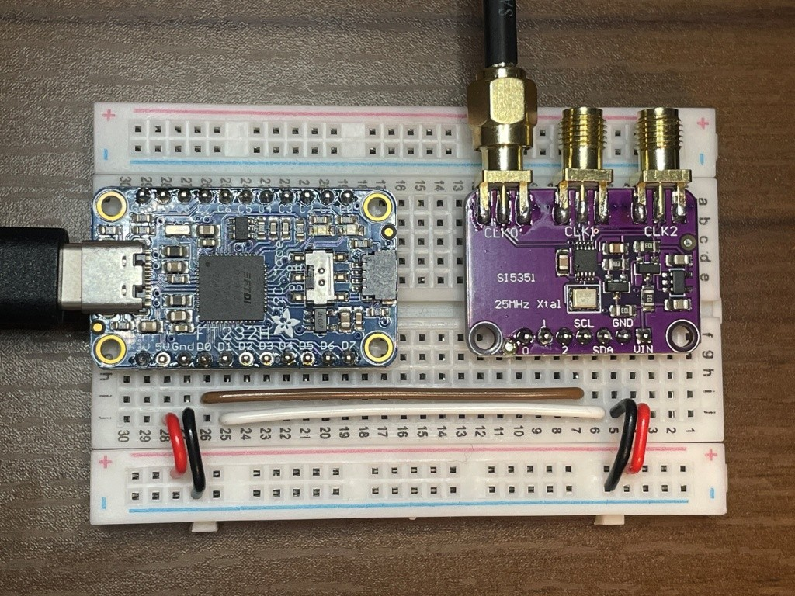
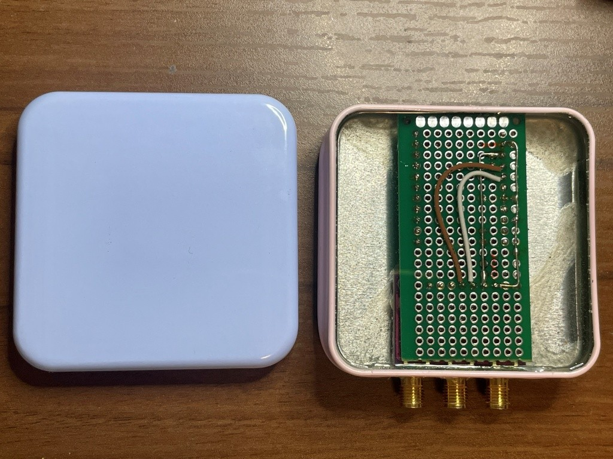

# SI5351A Clock Generator Frequency Setting Tool

## Overview
This project provides a Python-based command-line interface for configuring the SI5351A clock generator chip. The SI5351A is a programmable clock generator capable of generating high-precision, multiple independent clock outputs.

**日本語版のREADMEは[こちら](README_JP.md)をご覧ください。**

## Features
- **Multi-channel Output**: Configure up to 2 independent clock outputs
  - 1-channel output: CH0 only
  - 2-channel output: CH0 + CH2
  - Differential output: CH0 + CH1 (or CH2) pair
- **Differential Output Support**: Enable differential clock output on CH1 or CH2
- **Spread Spectrum Clocking (SSC)**: Reduce EMI with configurable frequency spread range
- **High Precision**: Accurate frequency generation using fractional PLL synthesis (frequency setting error: <0.0001%)
- **Test Mode**: Built-in parameter calculation verification function
- **Hardware Support**: Supports both Adafruit FT232H and Silicon Labs CP2112 USB-to-I2C adapters

## Requirements

### Environment
- **OS**: Windows 10/11

### Hardware
- SI5351A clock generator chip
- USB-to-I2C adapter (choose one):
  - **Adafruit FT232H** USB-to-I2C adapter, or
  - **Silicon Labs CP2112** USB-to-I2C adapter
- 25MHz crystal oscillator (connected to SI5351A)


*Breadboard setup showing SI5351A and USB-to-I2C adapter connections*


*100 yen case housing for the project*

### Software Dependencies

#### For FT232H
```bash
pip install --upgrade adafruit-blinka adafruit-platformdetect
pip install Adafruit_GPIO
```

#### For CP2112
```bash
pip install hidapi
```

## Installation

1. **Clone the repository**
   ```bash
   git clone https://github.com/hwengjp/si5351a_freq_setter
   cd si5351a_freq_setter
   ```

2. **Install dependencies**
   
   **For FT232H:**
   ```bash
   pip install --upgrade adafruit-blinka adafruit-platformdetect
   pip install Adafruit_GPIO
   ```
   
   **For CP2112:**
   ```bash
   pip install hidapi
   ```

3. **Hardware connection**
   - Connect USB-to-I2C adapter SCL to SI5351A SCL
   - Connect USB-to-I2C adapter SDA to SI5351A SDA
   - Connect USB-to-I2C adapter GND to SI5351A GND
   - Connect 25MHz crystal oscillator to SI5351A

### Executable (exe) Generation

You can generate an executable file using PyInstaller:

1. **Install PyInstaller**
   ```bash
   pip install pyinstaller
   ```

2. **Generate exe file**
   
   **For FT232H:**
   ```bash
   # Remove generated files
   pyinstaller si5351a_freq_setter_FT232H.py --clean

   # Generate single file exe (including libusb0.dll)
   pyinstaller si5351a_freq_setter_FT232H.py --onefile --add-binary "C:\\Windows\\System32\\libusb0.dll;."
   ```
   
   **For CP2112:**
   ```bash
   # Remove generated files
   pyinstaller si5351a_freq_setter_CP2112.py --clean

   # Generate single file exe
   pyinstaller si5351a_freq_setter_CP2112.py --onefile
   ```

The generated exe file will be placed in the `dist` folder.

## Usage

### Basic Usage

**For FT232H:**
```bash
# 1-channel output (CH0 only, 100MHz)
python si5351a_freq_setter_FT232H.py 100

# 2-channel output (CH0: 100MHz + CH2: 200MHz)
python si5351a_freq_setter_FT232H.py 100 200

# Differential output (channel 1) - CH0(100MHz) + CH1(100MHz inverted)
python si5351a_freq_setter_FT232H.py 100 -d 1

# Differential output (channel 1) + CH2 independent output - CH0(100MHz) + CH1(100MHz inverted) + CH2(200MHz)
python si5351a_freq_setter_FT232H.py 100 200 -d 1

# Differential output (channel 2) - CH0(100MHz) + CH2(100MHz inverted)
python si5351a_freq_setter_FT232H.py 100 -d 2

# Enable spread spectrum
python si5351a_freq_setter_FT232H.py 100 -s

# Test mode (parameter calculation test)
python si5351a_freq_setter_FT232H.py -t 10
```

**For CP2112:**
```bash
# 1-channel output (CH0 only, 100MHz)
python si5351a_freq_setter_CP2112.py 100

# 2-channel output (CH0: 100MHz + CH2: 200MHz)
python si5351a_freq_setter_CP2112.py 100 200

# Differential output (channel 1) - CH0(100MHz) + CH1(100MHz inverted)
python si5351a_freq_setter_CP2112.py 100 -d 1

# Differential output (channel 1) + CH2 independent output - CH0(100MHz) + CH1(100MHz inverted) + CH2(200MHz)
python si5351a_freq_setter_CP2112.py 100 200 -d 1

# Differential output (channel 2) - CH0(100MHz) + CH2(100MHz inverted)
python si5351a_freq_setter_CP2112.py 100 -d 2

# Enable spread spectrum
python si5351a_freq_setter_CP2112.py 100 -s

# Test mode (parameter calculation test)
python si5351a_freq_setter_CP2112.py -t 10
```

### Channel Configuration

- **1-channel output**: Only CH0 is enabled (CH1, CH2 are disabled)
- **2-channel output**: CH0 and CH2 are enabled (CH1 is disabled)
- **Differential output**: CH0 + specified channel (CH1 or CH2) are enabled
  - CH0: Normal signal
  - Specified channel: Inverted signal (same frequency)
- **Differential output + independent channel**: CH0 + differential channel + independent channel
  - Example: `-d 1` + `fout0` specified + `fout2` specified → CH0(normal) + CH1(inverted) + CH2(independent frequency)

### Command Line Options

- `fout0`: Output frequency for clock 0 (MHz)
- `fout2`: Output frequency for clock 2 (MHz, optional)
- `-d, --differential CHANNEL`: Enable differential output (1 or 2)
  - Differential output always uses the same frequency as CH0 and outputs an inverted signal to the specified channel
  - `-d 1`: Output inverted signal of CH0 frequency to CH1
  - `-d 2`: Output inverted signal of CH0 frequency to CH2
- `-s, --ssc`: Enable spread spectrum clocking
- `-a, --amp FLOAT`: Spread spectrum amplitude as percentage of frequency spread relative to base frequency (default: 0.015 = 1.5% p-p)
- `-m, --mode {CENTER,DOWN}`: Spread spectrum mode (default: DOWN)
- `-t, --test INT`: Run test mode with specified number of iterations

### Limitations

- `-d 2` and `fout2` cannot be specified simultaneously (CH2 can only be either differential output or independent output)
- `-d 1` and `fout2` can be specified simultaneously (CH1: differential, CH2: independent output)
- Frequency range: 0.004MHz to 200MHz
- VCO frequency range: 600MHz to 900MHz

#### High Frequency Output Limitations (Above 150MHz)

**Special limitations for 150MHz < frequency ≤ 200MHz range:**

In this range, according to Silicon Labs AN619 specification, DIVBY4 mode is automatically used. However, there are the following limitations:

1. **PLL Multiplier Limitation**: PLL multiplier `a` must be an **even integer** for stable operation
   - **Working frequency examples**: 162.5MHz (a=26), 175MHz (a=28), 187.5MHz (a=30), 200MHz (a=32)
   - **Non-working frequency examples**: 156.25MHz (a=25, odd), 160MHz (a=25.6, non-integer)

2. **VCO Frequency Requirement**: VCO frequency = output frequency × 4
   - VCO frequency must be an even multiple of 25MHz
   - Example: 162.5MHz → VCO=650MHz (26×25MHz)

3. **Integer Mode Required**: PLL must operate in integer mode
   - Fractional mode will not produce normal output

**Technical Details:**
- DIVBY4 mode uses a fixed divide ratio of 4
- Multisynth setting values are P1=0, P2=0, P3=1, MSx_INT=1, MSx_DIVBY4[1:0]=11b
- Stable operation is only possible when `a + b/c` is an even integer in PLL settings

Due to these limitations, the usable frequencies are limited in the range above 150MHz. If these conditions are not met when setting the frequency, the calculation will complete normally but no actual output will be obtained.

## Test Features

### Parameter Calculation Test
```bash
# For FT232H
python si5351a_freq_setter_FT232H.py -t 5

# For CP2112
python si5351a_freq_setter_CP2112.py -t 5
```

This test runs random tests in the following frequency ranges:
- 100-150 MHz
- 10-100 MHz
- 1-10 MHz
- 0.1-1 MHz
- 0.01-0.1 MHz
- 0.004-0.01 MHz

### Test Report
After test execution, the following information is displayed:
- Total test count
- Success count / failure count
- Success rate / failure rate
- Maximum error rate
- Detailed statistics by frequency range

## Troubleshooting

### FT232H Issues

1. **FT232H device not found**
   - Check USB connection
   - Verify that drivers are properly installed
   - Ensure FT232H is recognized by the system

2. **I2C communication error**
   - Check wiring connections (SCL, SDA, GND)
   - Verify SI5351A power supply
   - Check for proper pull-up resistors

3. **Frequency setting error**
   - Check if requested frequency is within range
   - Check parameter calculation limitations

### CP2112 Issues

1. **CP2112 device not found**
   - Check USB connection
   - Verify that CP2112 drivers are installed
   - Ensure CP2112 is recognized by the system

2. **HID communication error**
   - Check if CP2112 is properly connected
   - Verify device permissions
   - Check for conflicting drivers

3. **I2C communication error**
   - Check wiring connections (SCL, SDA, GND)
   - Verify SI5351A power supply
   - Check for proper pull-up resistors

4. **Frequency setting error**
   - Check if requested frequency is within range
   - Check parameter calculation limitations

## SI5351A Register Map Specification

This chapter shows the configuration of the main registers of the SI5351A chip. All registers are 8-bit wide.

### System Control Registers

| Address | Bit7 | Bit6 | Bit5 | Bit4 | Bit3 | Bit2 | Bit1 | Bit0 | Description |
|---------|------|------|------|------|------|------|------|------|-------------|
| 0x00 | SYS_INIT | LOL_B | LOL_A | LOS | Reserved[1] | Reserved[0] | REVID[1] | REVID[0] | System Status |
| 0x01 | SYS_INIT_STKY | LOS_B_STKY | LOL_A_STKY | LOS_STKY | Reserved[3] | Reserved[2] | Reserved[1] | Reserved[0] | Sticky Status |
| 0x02 | SYS_INIT_MASK | LOS_B_MASK | LOL_A_MASK | LOS_MASK | Reserved[3] | Reserved[2] | Reserved[1] | Reserved[0] | Interrupt Mask |
| 0x03 | CLK7_EN | CLK6_EN | CLK5_EN | CLK4_EN | CLK3_EN | CLK2_EN | CLK1_EN | CLK0_EN | Output Enable |

### Input/Output Control Registers

| Address | Bit7 | Bit6 | Bit5 | Bit4 | Bit3 | Bit2 | Bit1 | Bit0 | Description |
|---------|------|------|------|------|------|------|------|------|-------------|
| 0x09 | OEB_MASK7 | OEB_MASK6 | OEB_MASK5 | OEB_MASK4 | OEB_MASK3 | OEB_MASK2 | OEB_MASK1 | OEB_MASK0 | Output Buffer Mask |
| 0x0F | CLKIN_DIV[2] | CLKIN_DIV[1] | CLKIN_DIV[0] | 0 | 0 | PLLB_SRC | PLLA_SRC | 0 | Input Divider & PLL Settings |

### Clock Control Registers (CLK0-CLK7)

| Address | Bit7 | Bit6 | Bit5 | Bit4 | Bit3 | Bit2 | Bit1 | Bit0 | Description |
|---------|------|------|------|------|------|------|------|------|-------------|
| 0x10 | CLK0_PDN | MS0_INT | MS0_SRC | CLK0_INV | CLK0_SRC[1] | CLK0_SRC[0] | CLK0_IDRV[1] | CLK0_IDRV[0] | CLK0 Settings |
| 0x11 | CLK1_PDN | MS1_INT | MS1_SRC | CLK1_INV | CLK1_SRC[1] | CLK1_SRC[0] | CLK1_IDRV[1] | CLK1_IDRV[0] | CLK1 Settings |
| 0x12 | CLK2_PDN | MS2_INT | MS2_SRC | CLK2_INV | CLK2_SRC[1] | CLK2_SRC[0] | CLK2_IDRV[1] | CLK2_IDRV[0] | CLK2 Settings |
| 0x16 | CLK6_PDN | FBA_INT | MS6_SRC | CLK6_INV | CLK6_SRC[1] | CLK6_SRC[0] | CLK6_IDRV[1] | CLK6_IDRV[0] | CLK6 Settings |
| 0x17 | CLK7_PDN | FBB_INT | MS7_SRC | CLK7_INV | CLK7_SRC[1] | CLK7_SRC[0] | CLK7_IDRV[1] | CLK7_IDRV[0] | CLK7 Settings |

### PLL Setting Registers

#### PLLA (0x1A-0x21)
| Address | Bit[7:0] | Description |
|---------|----------|-------------|
| 0x1A | MSNA_P3[15:8] | PLLA P3 Parameter Upper |
| 0x1B | MSNA_P3[7:0] | PLLA P3 Parameter Lower |
| 0x1C | Reserved[7:2], MSNA_P1[17:16] | PLLA P1 Parameter Most Significant |
| 0x1D | MSNA_P1[15:8] | PLLA P1 Parameter Upper |
| 0x1E | MSNA_P1[7:0] | PLLA P1 Parameter Lower |
| 0x1F | MSNA_P3[19:16], MSNA_P2[19:16] | PLLA P3 Upper/P2 Upper |
| 0x20 | MSNA_P2[15:8] | PLLA P2 Parameter Upper |
| 0x21 | MSNA_P2[7:0] | PLLA P2 Parameter Lower |

#### PLLB (0x22-0x29)
| Address | Bit[7:0] | Description |
|---------|----------|-------------|
| 0x22 | MSNB_P3[15:8] | PLLB P3 Parameter Upper |
| 0x23 | MSNB_P3[7:0] | PLLB P3 Parameter Lower |
| 0x24 | MSNB_P1[17:16], Reserved[5:0] | PLLB P1 Most Significant/Reserved |
| 0x25 | MSNB_P1[15:8] | PLLB P1 Parameter Upper |
| 0x26 | MSNB_P1[7:0] | PLLB P1 Parameter Lower |
| 0x27 | MSNB_P3[19:16], MSNB_P2[19:16] | PLLB P3 Upper/P2 Upper |
| 0x28 | MSNB_P2[15:8] | PLLB P2 Parameter Upper |
| 0x29 | MSNB_P2[7:0] | PLLB P2 Parameter Lower |

### Multisynth Setting Registers

#### MS0 (CLK0) - 0x2A-0x31
| Address | Bit[7:0] | Description |
|---------|----------|-------------|
| 0x2A | MS0_P3[15:8] | MS0 P3 Parameter Upper |
| 0x2B | MS0_P3[7:0] | MS0 P3 Parameter Lower |
| **0x2C** | **Reserved[7], R0_DIV[6:4], MS0_DIVBY4[3:2], MS0_P1[17:16]** | **DIVBY4 Control Register** |
| 0x2D | MS0_P1[15:8] | MS0 P1 Parameter Upper |
| 0x2E | MS0_P1[7:0] | MS0 P1 Parameter Lower |
| 0x2F | MS0_P3[19:16], MS0_P2[19:16] | MS0 P3 Upper/P2 Upper |
| 0x30 | MS0_P2[15:8] | MS0 P2 Parameter Upper |
| 0x31 | MS0_P2[7:0] | MS0 P2 Parameter Lower |

#### MS1 (CLK1) - 0x32-0x39
| Address | Bit[7:0] | Description |
|---------|----------|-------------|
| 0x32 | MS1_P3[15:8] | MS1 P3 Parameter Upper |
| 0x33 | MS1_P3[7:0] | MS1 P3 Parameter Lower |
| **0x34** | **Reserved[7], R1_DIV[6:4], MS1_DIVBY4[3:2], MS1_P1[17:16]** | **DIVBY4 Control Register** |
| 0x35 | MS1_P1[15:8] | MS1 P1 Parameter Upper |
| 0x36 | MS1_P1[7:0] | MS1 P1 Parameter Lower |
| 0x37 | MS1_P3[19:16], MS1_P2[19:16] | MS1 P3 Upper/P2 Upper |
| 0x38 | MS1_P2[15:8] | MS1 P2 Parameter Upper |
| 0x39 | MS1_P2[7:0] | MS1 P2 Parameter Lower |

#### MS2 (CLK2) - 0x3A-0x41
| Address | Bit[7:0] | Description |
|---------|----------|-------------|
| 0x3A | MS2_P3[15:8] | MS2 P3 Parameter Upper |
| 0x3B | MS2_P3[7:0] | MS2 P3 Parameter Lower |
| **0x3C** | **Reserved[7], R2_DIV[6:4], MS2_DIVBY4[3:2], MS2_P1[17:16]** | **DIVBY4 Control Register** |
| 0x3D | MS2_P1[15:8] | MS2 P1 Parameter Upper |
| 0x3E | MS2_P1[7:0] | MS2 P1 Parameter Lower |
| 0x3F | MS2_P3[19:16], MS2_P2[19:16] | MS2 P3 Upper/P2 Upper |
| 0x40 | MS2_P2[15:8] | MS2 P2 Parameter Upper |
| 0x41 | MS2_P2[7:0] | MS2 P2 Parameter Lower |

### Spread Spectrum Control Registers

| Address | Bit7 | Bit6-0 | Description |
|---------|------|--------|-------------|
| 0x95 | SSC_EN | SSDN_P2[14:8] | SSC Enable & Down Spread P2 |
| 0x96 | - | SSDN_P2[7:0] | Down Spread P2 Lower |
| 0x97 | SSC_MODE | SSDN_P3[14:8] | SSC Mode & Down Spread P3 |

### DIVBY4 Bit Definitions

**MS_DIVBY4[1:0] bit values:**
- `00b` = DIVBY4 disabled (normal divider operation)
- `01b` = Reserved
- `10b` = Reserved  
- `11b` = DIVBY4 enabled (fixed divide ratio of 4)

**Important:** For outputs above 150MHz, the corresponding MS_DIVBY4[1:0] must be set to `11b`.

### System Control Registers

| Address | Bit7 | Bit6-0 | Description |
|---------|------|--------|-------------|
| 0xB1 | PLLB_RST | Reserved, PLLA_RST, Reserved[4:0] | PLL Reset Control |
| 0xB7 | XTAL_CL | Reserved[6:0] | Crystal Oscillator Load Capacitance Setting |
| 0xBB | CLKIN_FANOUT_EN | XO_FANOUT_EN, Reserved, MS_FANOUT_EN, Reserved[3:0] | Fanout Control |

## License

This project is released under the GNU General Public License v3.0.

## Contributing

Please report bugs and feature requests on the GitHub Issues page.

## Acknowledgments

- Original SI5351A Python module by Owain Martin
- FT232H library by Adafruit Industries
- CP2112 HID library support