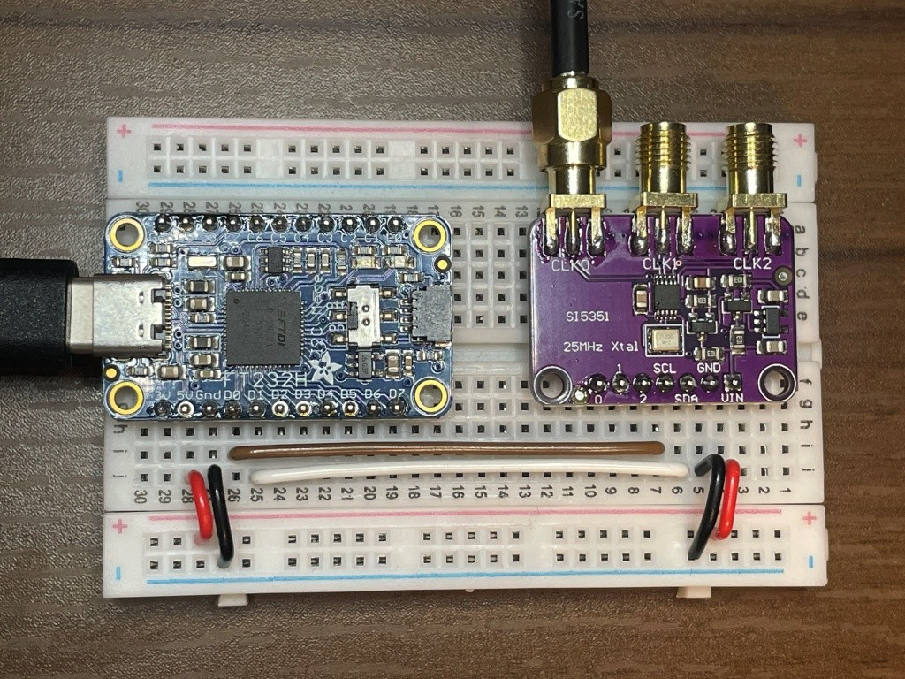
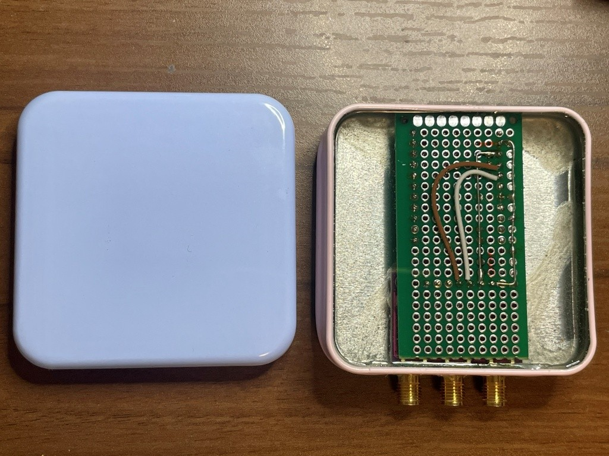

# SI5351A クロックジェネレータ周波数設定ツール

## 概要
このプロジェクトは、SI5351Aクロックジェネレータチップを設定するためのPythonベースのコマンドラインインターフェースを提供します。SI5351Aは、高精度で複数の独立したクロック出力を生成できるプログラマブルクロックジェネレータです。

## 機能
- **マルチチャネル出力**: 最大2つの独立したクロック出力を設定
  - 1チャネル出力: CH0のみ
  - 2チャネル出力: CH0 + CH2
  - ディファレンシャル出力: CH0 + CH1（またはCH2）のペア
- **ディファレンシャル出力対応**: CH1または2でディファレンシャルクロック出力を有効化
- **スプレッドスペクトラムクロッキング（SSC）**: 設定可能な周波数拡散範囲
- **高精度**: 分数PLL合成による正確な周波数生成（周波数設定誤差: 0.0001%未満）
- **テストモード**: 内蔵パラメータ計算検証機能
- **複数ハードウェア対応**: FT232HまたはCP2112を使用したI2C通信

## 必要条件

### 環境
- **OS**: Windows 10/11

### ハードウェア
- SI5351Aクロックジェネレータチップ
- **I2C-USB変換器**（以下のいずれか）:
  - Adafruit FT232H USB-to-I2Cアダプタ
  - Silicon Labs CP2112 USB-to-I2Cアダプタ
- 25MHz水晶発振器（SI5351Aに接続）


*SI5351AとI2C-USB変換器の接続を示すブレッドボードセットアップ*


*プロジェクト用の100円ケース*

### ソフトウェア依存関係

#### FT232H使用時
```bash
pip install --upgrade adafruit-blinka adafruit-platformdetect
pip install Adafruit_GPIO
```

#### CP2112使用時
```bash
pip install hidapi
```

## インストール

1. **リポジトリをクローン**
   ```bash
   git clone https://github.com/hwengjp/si5351a_freq_setter
   cd si5351a_freq_setter
   ```

2. **依存関係をインストール**
   - **FT232H使用時**:
     ```bash
     pip install --upgrade adafruit-blinka adafruit-platformdetect
     pip install Adafruit_GPIO
     ```
   - **CP2112使用時**:
     ```bash
     pip install hidapi
     ```

3. **ハードウェア接続**
   - I2C-USB変換器のSCLをSI5351AのSCLに接続
   - I2C-USB変換器のSDAをSI5351AのSDAに接続
   - I2C-USB変換器のGNDをSI5351AのGNDに接続
   - 25MHz水晶発振器をSI5351Aに接続

### 実行ファイル（exe）の生成

PyInstallerを使用して実行ファイルを生成できます：

1. **PyInstallerをインストール**
   ```bash
   pip install pyinstaller
   ```

2. **exeファイルを生成**
   ```bash
   # FT232H版
   pyinstaller si5351a_freq_setter_FT232H.py --clean
   pyinstaller si5351a_freq_setter_FT232H.py --onefile --add-binary "C:\\Windows\\System32\\libusb0.dll;."
   
   # CP2112版
   pyinstaller si5351a_freq_setter_CP2112.py --clean
   pyinstaller si5351a_freq_setter_CP2112.py --onefile
   ```

生成されたexeファイルは`dist`フォルダに配置されます。

## 使用方法

### ハードウェア選択

使用するI2C-USB変換器に応じて、適切なプログラムを選択してください：

- **FT232H使用時**: `si5351a_freq_setter_FT232H.py`
- **CP2112使用時**: `si5351a_freq_setter_CP2112.py`

### 基本的な使用方法

```bash
# 1チャネル出力（CH0のみ、100MHz）
python si5351a_freq_setter_FT232H.py 100    # FT232H使用時
python si5351a_freq_setter_CP2112.py 100    # CP2112使用時

# 2チャネル出力（CH0: 100MHz + CH2: 200MHz）
python si5351a_freq_setter_FT232H.py 100 200
python si5351a_freq_setter_CP2112.py 100 200

# ディファレンシャル出力（チャネル1）- CH0(100MHz) + CH1(100MHz反転)
python si5351a_freq_setter_FT232H.py 100 -d 1
python si5351a_freq_setter_CP2112.py 100 -d 1

# ディファレンシャル出力（チャネル1）+ CH2独立出力 - CH0(100MHz) + CH1(100MHz反転) + CH2(200MHz)
python si5351a_freq_setter_FT232H.py 100 200 -d 1
python si5351a_freq_setter_CP2112.py 100 200 -d 1

# ディファレンシャル出力（チャネル2）- CH0(100MHz) + CH2(100MHz反転)
python si5351a_freq_setter_FT232H.py 100 -d 2
python si5351a_freq_setter_CP2112.py 100 -d 2

# スプレッドスペクトラム有効
python si5351a_freq_setter_FT232H.py 100 -s
python si5351a_freq_setter_CP2112.py 100 -s

# テストモード（パラメータ計算テスト）
python si5351a_freq_setter_FT232H.py -t 10
python si5351a_freq_setter_CP2112.py -t 10
```

### チャネル構成

- **1チャネル出力**: CH0のみが有効（CH1、CH2は無効）
- **2チャネル出力**: CH0とCH2が有効（CH1は無効）
- **ディファレンシャル出力**: CH0 + 指定チャネル（CH1またはCH2）が有効
  - CH0: 通常信号
  - 指定チャネル: 反転信号（同じ周波数）
- **ディファレンシャル出力 + 独立チャネル**: CH0 + ディファレンシャルチャネル + 独立チャネル
  - 例: `-d 1` + `fout0`指定 + `fout2`指定 → CH0(通常) + CH1(反転) + CH2(独立周波数)

### コマンドラインオプション

- `fout0`: クロック0の出力周波数（MHz）
- `fout2`: クロック2の出力周波数（MHz、オプション）
- `-d, --differential CHANNEL`: ディファレンシャル出力を有効化（1または2）
  - ディファレンシャル出力は常にCH0と同じ周波数で、指定したチャネルに反転信号を出力
  - `-d 1`: CH1にCH0と同じ周波数の反転信号を出力
  - `-d 2`: CH2にCH0と同じ周波数の反転信号を出力
- `-s, --ssc`: スプレッドスペクトラムクロッキングを有効化
- `-a, --amp FLOAT`: 基本周波数に対する周波数拡散のパーセンテージ（デフォルト: 0.015 = 1.5% p-p）
- `-m, --mode {CENTER,DOWN}`: スプレッドスペクトラムモード（デフォルト: DOWN）
- `-t, --test INT`: テストモードで指定回数のイテレーションを実行

### 制限事項

- `-d 2`と`fout2`を同時に指定することはできません（CH2はディファレンシャル出力または独立出力のいずれかのみ）
- `-d 1`と`fout2`は同時に指定可能（CH1: ディファレンシャル、CH2: 独立出力）
- 周波数範囲: 0.004MHz ～ 200MHz
- VCO周波数範囲: 600MHz ～ 900MHz

#### 高周波数出力の制限（150MHz超）

**150MHz < 周波数 ≤ 200MHz範囲の特別な制限事項:**

この範囲では、Silicon Labs AN619仕様書に従い、DIVBY4モードが自動的に使用されます。ただし、以下の制限があります：

1. **PLL倍率制限**: PLL倍率 `a` が**偶数の整数**である場合のみ安定動作
   - **動作する周波数例**: 162.5MHz (a=26), 175MHz (a=28), 187.5MHz (a=30), 200MHz (a=32)
   - **動作しない周波数例**: 156.25MHz (a=25, 奇数), 160MHz (a=25.6, 非整数)

2. **VCO周波数要件**: VCO周波数 = 出力周波数 × 4
   - VCO周波数が25MHzの偶数倍になる必要がある
   - 例: 162.5MHz → VCO=650MHz (26×25MHz)

3. **整数モード必須**: PLLは整数モードで動作する必要がある
   - 分数モードでは正常な出力が得られない

**技術的詳細:**
- DIVBY4モードでは固定分周比4が使用される
- マルチシンセ設定値は P1=0, P2=0, P3=1, MSx_INT=1, MSx_DIVBY4[1:0]=11b
- PLL設定において `a + b/c` が偶数整数の場合のみ安定動作が可能

この制限により、150MHz超の範囲では使用可能な周波数が限定されます。周波数設定時にこれらの条件を満たさない場合、計算は正常に完了しても実際の出力は得られません。

## テスト機能

### パラメータ計算テスト
```bash
python si5351a_freq_setter_FT232H.py -t 5    # FT232H使用時
python si5351a_freq_setter_CP2112.py -t 5    # CP2112使用時
```

このテストは以下の周波数範囲でランダムテストを実行します：
- 100-150 MHz
- 10-100 MHz
- 1-10 MHz
- 0.1-1 MHz
- 0.01-0.1 MHz
- 0.004-0.01 MHz

### テストレポート
テスト実行後、以下の情報が表示されます：
- 総テスト数
- 成功数・失敗数
- 成功率・失敗率
- 最大エラー率
- 周波数範囲別の詳細統計

## トラブルシューティング

### よくある問題

1. **I2C-USB変換器デバイスが見つからない**
   - USB接続を確認
   - ドライバーが正しくインストールされているか確認
   - **FT232H**: Adafruit Blinkaライブラリがインストールされているか確認
   - **CP2112**: hidapiライブラリがインストールされているか確認

2. **I2C通信エラー**
   - 配線接続を確認
   - SI5351Aの電源供給を確認
   - I2Cアドレス（0x60）が正しいか確認

3. **周波数設定エラー**
   - 要求周波数が範囲内か確認
   - パラメータ計算の制限を確認

### ハードウェア固有の問題

#### FT232H使用時
- **libusb0.dllエラー**: システムにlibusb0.dllがインストールされているか確認
- **権限エラー**: 管理者権限で実行を試行

#### CP2112使用時
- **HIDデバイス認識エラー**: CP2112ドライバーが正しくインストールされているか確認
- **VID/PIDエラー**: デバイスが0x10C4/0xEA90で認識されているか確認

## SI5351A レジスタマップ仕様

この章では、SI5351Aチップの主要レジスタの構成を示します。すべてのレジスタは8ビット幅です。

### システム制御レジスタ

| アドレス | ビット7 | ビット6 | ビット5 | ビット4 | ビット3 | ビット2 | ビット1 | ビット0 | 説明 |
|----------|---------|---------|---------|---------|---------|---------|---------|---------|------|
| 0x00 | SYS_INIT | LOL_B | LOL_A | LOS | Reserved[1] | Reserved[0] | REVID[1] | REVID[0] | システム状態 |
| 0x01 | SYS_INIT_STKY | LOS_B_STKY | LOL_A_STKY | LOS_STKY | Reserved[3] | Reserved[2] | Reserved[1] | Reserved[0] | スティッキ状態 |
| 0x02 | SYS_INIT_MASK | LOS_B_MASK | LOL_A_MASK | LOS_MASK | Reserved[3] | Reserved[2] | Reserved[1] | Reserved[0] | 割り込みマスク |
| 0x03 | CLK7_EN | CLK6_EN | CLK5_EN | CLK4_EN | CLK3_EN | CLK2_EN | CLK1_EN | CLK0_EN | 出力イネーブル |

### 入力/出力制御レジスタ

| アドレス | ビット7 | ビット6 | ビット5 | ビット4 | ビット3 | ビット2 | ビット1 | ビット0 | 説明 |
|----------|---------|---------|---------|---------|---------|---------|---------|---------|------|
| 0x09 | OEB_MASK7 | OEB_MASK6 | OEB_MASK5 | OEB_MASK4 | OEB_MASK3 | OEB_MASK2 | OEB_MASK1 | OEB_MASK0 | 出力バッファマスク |
| 0x0F | CLKIN_DIV[2] | CLKIN_DIV[1] | CLKIN_DIV[0] | 0 | 0 | PLLB_SRC | PLLA_SRC | 0 | 入力分周・PLL設定 |

### クロック制御レジスタ (CLK0-CLK7)

| アドレス | ビット7 | ビット6 | ビット5 | ビット4 | ビット3 | ビット2 | ビット1 | ビット0 | 説明 |
|----------|---------|---------|---------|---------|---------|---------|---------|---------|------|
| 0x10 | CLK0_PDN | MS0_INT | MS0_SRC | CLK0_INV | CLK0_SRC[1] | CLK0_SRC[0] | CLK0_IDRV[1] | CLK0_IDRV[0] | CLK0設定 |
| 0x11 | CLK1_PDN | MS1_INT | MS1_SRC | CLK1_INV | CLK1_SRC[1] | CLK1_SRC[0] | CLK1_IDRV[1] | CLK1_IDRV[0] | CLK1設定 |
| 0x12 | CLK2_PDN | MS2_INT | MS2_SRC | CLK2_INV | CLK2_SRC[1] | CLK2_SRC[0] | CLK2_IDRV[1] | CLK2_IDRV[0] | CLK2設定 |
| 0x16 | CLK6_PDN | FBA_INT | MS6_SRC | CLK6_INV | CLK6_SRC[1] | CLK6_SRC[0] | CLK6_IDRV[1] | CLK6_IDRV[0] | CLK6設定 |
| 0x17 | CLK7_PDN | FBB_INT | MS7_SRC | CLK7_INV | CLK7_SRC[1] | CLK7_SRC[0] | CLK7_IDRV[1] | CLK7_IDRV[0] | CLK7設定 |

### PLL設定レジスタ

#### PLLA (0x1A-0x21)
| アドレス | ビット[7:0] | 説明 |
|----------|-------------|------|
| 0x1A | MSNA_P3[15:8] | PLLA P3パラメータ上位 |
| 0x1B | MSNA_P3[7:0] | PLLA P3パラメータ下位 |
| 0x1C | Reserved[7:2], MSNA_P1[17:16] | PLLA P1パラメータ最上位 |
| 0x1D | MSNA_P1[15:8] | PLLA P1パラメータ上位 |
| 0x1E | MSNA_P1[7:0] | PLLA P1パラメータ下位 |
| 0x1F | MSNA_P3[19:16], MSNA_P2[19:16] | PLLA P3上位/P2上位 |
| 0x20 | MSNA_P2[15:8] | PLLA P2パラメータ上位 |
| 0x21 | MSNA_P2[7:0] | PLLA P2パラメータ下位 |

#### PLLB (0x22-0x29)
| アドレス | ビット[7:0] | 説明 |
|----------|-------------|------|
| 0x22 | MSNB_P3[15:8] | PLLB P3パラメータ上位 |
| 0x23 | MSNB_P3[7:0] | PLLB P3パラメータ下位 |
| 0x24 | MSNB_P1[17:16], Reserved[5:0] | PLLB P1最上位/予約 |
| 0x25 | MSNB_P1[15:8] | PLLB P1パラメータ上位 |
| 0x26 | MSNB_P1[7:0] | PLLB P1パラメータ下位 |
| 0x27 | MSNB_P3[19:16], MSNB_P2[19:16] | PLLB P3上位/P2上位 |
| 0x28 | MSNB_P2[15:8] | PLLB P2パラメータ上位 |
| 0x29 | MSNB_P2[7:0] | PLLB P2パラメータ下位 |

### マルチシンセ設定レジスタ

#### MS0 (CLK0) - 0x2A-0x31
| アドレス | ビット[7:0] | 説明 |
|----------|-------------|------|
| 0x2A | MS0_P3[15:8] | MS0 P3パラメータ上位 |
| 0x2B | MS0_P3[7:0] | MS0 P3パラメータ下位 |
| **0x2C** | **Reserved[7], R0_DIV[6:4], MS0_DIVBY4[3:2], MS0_P1[17:16]** | **DIVBY4制御レジスタ** |
| 0x2D | MS0_P1[15:8] | MS0 P1パラメータ上位 |
| 0x2E | MS0_P1[7:0] | MS0 P1パラメータ下位 |
| 0x2F | MS0_P3[19:16], MS0_P2[19:16] | MS0 P3上位/P2上位 |
| 0x30 | MS0_P2[15:8] | MS0 P2パラメータ上位 |
| 0x31 | MS0_P2[7:0] | MS0 P2パラメータ下位 |

#### MS1 (CLK1) - 0x32-0x39
| アドレス | ビット[7:0] | 説明 |
|----------|-------------|------|
| 0x32 | MS1_P3[15:8] | MS1 P3パラメータ上位 |
| 0x33 | MS1_P3[7:0] | MS1 P3パラメータ下位 |
| **0x34** | **Reserved[7], R1_DIV[6:4], MS1_DIVBY4[3:2], MS1_P1[17:16]** | **DIVBY4制御レジスタ** |
| 0x35 | MS1_P1[15:8] | MS1 P1パラメータ上位 |
| 0x36 | MS1_P1[7:0] | MS1 P1パラメータ下位 |
| 0x37 | MS1_P3[19:16], MS1_P2[19:16] | MS1 P3上位/P2上位 |
| 0x38 | MS1_P2[15:8] | MS1 P2パラメータ上位 |
| 0x39 | MS1_P2[7:0] | MS1 P2パラメータ下位 |

#### MS2 (CLK2) - 0x3A-0x41
| アドレス | ビット[7:0] | 説明 |
|----------|-------------|------|
| 0x3A | MS2_P3[15:8] | MS2 P3パラメータ上位 |
| 0x3B | MS2_P3[7:0] | MS2 P3パラメータ下位 |
| **0x3C** | **Reserved[7], R2_DIV[6:4], MS2_DIVBY4[3:2], MS2_P1[17:16]** | **DIVBY4制御レジスタ** |
| 0x3D | MS2_P1[15:8] | MS2 P1パラメータ上位 |
| 0x3E | MS2_P1[7:0] | MS2 P1パラメータ下位 |
| 0x3F | MS2_P3[19:16], MS2_P2[19:16] | MS2 P3上位/P2上位 |
| 0x40 | MS2_P2[15:8] | MS2 P2パラメータ上位 |
| 0x41 | MS2_P2[7:0] | MS2 P2パラメータ下位 |

### スプレッドスペクトラム制御レジスタ

| アドレス | ビット7 | ビット6-0 | 説明 |
|----------|---------|-----------|------|
| 0x95 | SSC_EN | SSDN_P2[14:8] | SSC有効化・Down Spread P2 |
| 0x96 | - | SSDN_P2[7:0] | Down Spread P2下位 |
| 0x97 | SSC_MODE | SSDN_P3[14:8] | SSCモード・Down Spread P3 |

### DIVBY4ビット定義

**MS_DIVBY4[1:0]ビット値:**
- `00b` = DIVBY4無効 (通常分周動作)
- `01b` = 予約済み
- `10b` = 予約済み  
- `11b` = DIVBY4有効 (分周比4固定)

**重要:** 150MHz超の出力では、対応するMS_DIVBY4[1:0]を`11b`に設定する必要があります。

### システム制御レジスタ

| アドレス | ビット7 | ビット6-0 | 説明 |
|----------|---------|-----------|------|
| 0xB1 | PLLB_RST | Reserved, PLLA_RST, Reserved[4:0] | PLL リセット制御 |
| 0xB7 | XTAL_CL | Reserved[6:0] | 水晶発振器負荷容量設定 |
| 0xBB | CLKIN_FANOUT_EN | XO_FANOUT_EN, Reserved, MS_FANOUT_EN, Reserved[3:0] | ファンアウト制御 |

## ライセンス

このプロジェクトはGNU General Public License v3.0の下で公開されています。

## 貢献

バグレポートや機能要求は、GitHubのIssuesページでお知らせください。

## 謝辞

- Owain Martin氏による元のSI5351A Pythonモジュール
- Adafruit IndustriesによるFT232Hライブラリ